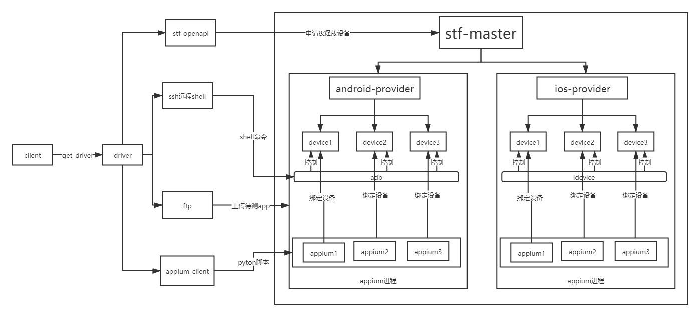
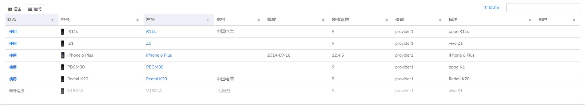
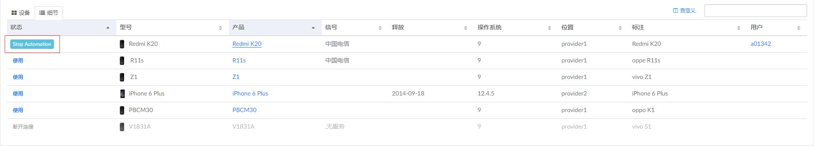

#  一、背景
之前搭建过一套stf的真机云测平台，最近在搞app自动化，想将stf与appium结合起来，搭建app真机自动化平台

# 二、架构图

>备注：android-provider功能已实现，ios-provider功能待实现

# 三、前期准备
##### 1、手机上安装Appium setting等appium工具  
##### 2、部署stf服务，将手机接入stf网络，配置stf-openapi token。注意，一定要先安装Appium setting.apk再接入stf，不然会被stf还原  
>stf部署参考文档：[Android部署](https://testerhome.com/topics/17233)  、[IOS部署](https://testerhome.com/topics/19548)  
>stf openapi参考文档：[stf-openapi](https://blog.csdn.net/u011608531/article/details/105283652)  

  


##### 3、在stf-provider节点启动appium进程，一个appium进程绑定一台手机
```shell script
#/bin/bash
nohup appium -p 4725 -U a32a6a4e --session-override > appium_a32a6a4e.log &
nohup appium -p 4726 -U b046c875 --session-override > appium_b046c875.log &
```
##### 4、更改driver.config相应配置  

#  四、基本工作流程
##### 1、ftp上传app到provider服务器  
##### 2、获取到可用的设备号serial_no  
   ```python
# 设备连接状态
@unique
class DeviceStatusEnum(Enum):
    # adb连接正常
    ADB_READY = 'ADB_READY'
    # appium连接正常
    APPIUM_READY = 'APPIUM_READY'
    # stf连接正常
    STF_READY = 'STF_READY'
    # stf被占用
    STF_LOCKED = 'STF_LOCKED'
   ```
定义设备连接状态，APPIUM_READY，STF_READY状态的设备才可用，优先返回STF_READY状态的设备    
>存在问题：  
>stf暂时无法连接android 10系统的手机，但是绑定appium进程后也可以执行自动化脚本，故优先取STF_READY状态的设备，再取APPIUM_READY状态的设备    

##### 3、启动driver，不指定package和activity   
```python
desired_caps = {
                "platformName": self.platform,
                # appium setting不需要重复安装
                "skipServerInstallation": True,
                "skipDeviceInitialization": True,
                "deviceName": serial_no,
            }
driver = webdriver.Remote(appium_hub, desired_caps)
```  
##### 4、另开线程执行adb install命令，主进程通过appium点击继续安装按钮    
  
  
```python
def _confirm_install_app(self, ssh_client: SSHClient, driver, serial_no):
    '''
    确认安装apk，需要根据不同机型适配
    :param ssh_client:ssh对象
    :param driver: driver对象
    :param serial_no: 设备编号
    :return: start_activity的opts参数，解决启动的activity不是指定的activity场景
    {
            'app_wait_package': 'com.android.packageinstaller',
            'app_wait_activity': '.permission.ui.GrantPermissionsActivity'
    }
    '''
    opts = {}
    # Redmi K20点击继续安装按钮
    if serial_no == 'ca352a47':
        # 启动后的activity与目标的不一样，需要设置start_activity方法的app_wait_package，app_wait_activity
        opts = {
            'app_wait_package': 'com.lbe.security.miui',
            'app_wait_activity': 'com.android.packageinstaller.permission.ui.GrantPermissionsActivity'
        }
        # 点击继续安装按钮
        WebDriverWait(driver, driver_wait_timeout, driver_wait_poll_frequency).until(
            EC.element_to_be_clickable((By.ID, "android:id/button2"))
        ).click()

    return opts
```   
需要根据不同的机型适配确认安装操作和启动后的app_wait_package，app_wait_activity参数  
##### 5、启动app
```python
# 启动app
driver.start_activity(package_name, activity_name, appWaitDuration=10000, **opts)
time.sleep(1)
driver.switch_to.alert.accept()
```  

>备注：此状态为设备占用状态，可以点击进去查看实时执行效果

#### 以上流程实现apk安装到启动的流程  

# 五、具体使用
```python
from driver.driver_manager import DriverManager

app_path = 'xxx'
package_name, activity_name = 'xxx', 'xxx'
# 初始化并上传app
mDriverManager = DriverManager('android', app_path)

# 1、获取任意一个可用设备
driver_info = mDriverManager.get_driver(package_name, activity_name)
# 2、获取指定标号的设备
driver_info = mDriverManager.get_driver(package_name, activity_name, serial_no='ca352a47')
# 3、获取所有可用设备
driver_info = mDriverManager.get_driver(package_name, activity_name, acquire_all_device=True)
print(driver_info)
# 获取driver对象
for serial_no in driver_info:
    driver = driver_info[serial_no]['driver']
# 释放设备
mDriverManager.close()
'''
driver_info示例
{
	'ca352a47': {
		'device_status': 'STF_LOCKED',
		'appium_hub': 'http://1.1.1.1:4727/wd/hub',
		'ssh_client':  < driver.ssh_manager.SSHClient object at 0x000001EAD52CA860 > ,
		'release': '9',
		'sdk': '28',
		'manufacturer': 'Xiaomi',
		'model': 'Redmi K20',
		'wm_size': '1080x2340',
		'driver':  < appium.webdriver.webdriver.WebDriver(session = "246646ac-bf0a-49a8-8b99-7a68b40a7444") >
	}
}
'''
```  

# 六、当前进展&后续开发拓展计划
>#### 当前完成度：  
>android接入5台设备，完成测试app简单的登录退出demo

>#### 后续开发拓展计划:  
>1、接入ios-provider  
>2、完善框架日志和录屏功能  
>3、编写文档，准备团队内推广  